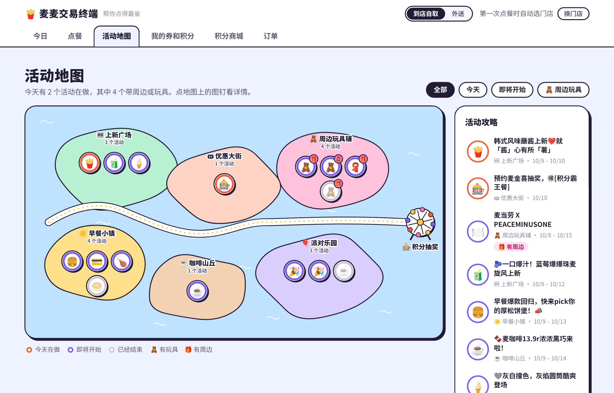
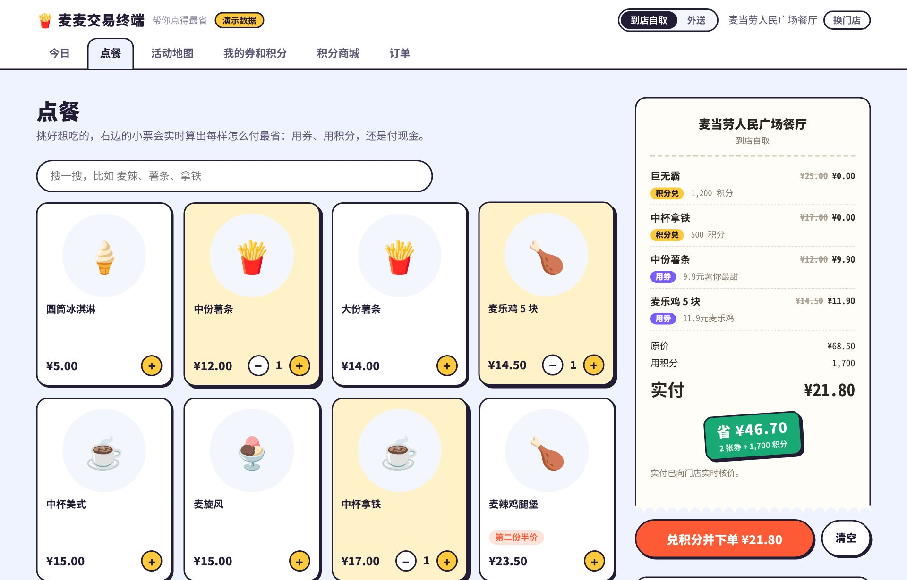
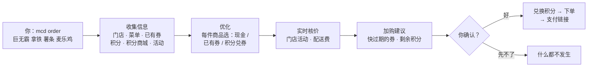

<div align="center">

# 🍟 麦麦交易终端

**帮你点麦当劳最省的 Skill**

自动叠加优惠券、积分和门店活动，实时核价，算出这一单怎么付最划算。<br>
让 AI 帮你点，或者自己在终端里点，都行。

[](https://github.com/Zhangfengmo/mcd-terminal/releases/latest)


[](#更多)

[快速开始](#快速开始) · [网页版](#网页版mcd-web) · [功能](#功能) · [原理剖析](#原理剖析) · [作为 Skill 使用](#作为-skill-使用) · [使用示例](#使用示例) · [常见问题](#常见问题) · [反馈与参与](#反馈与参与)


</div>

## 快速开始

**1. 安装**（一行命令，不需要 Python）

```bash
# macOS / Linux / WSL · 国内网络
curl -fsSL --max-time 60 https://gh-proxy.com/https://github.com/Zhangfengmo/mcd-terminal/releases/latest/download/install.sh | bash

# macOS / Linux / WSL · 海外网络
curl -fsSL --max-time 60 https://github.com/Zhangfengmo/mcd-terminal/releases/latest/download/install.sh | bash
```

```powershell
# Windows PowerShell · 国内网络（海外网络去掉 https://gh-proxy.com/ 前缀）
irm https://gh-proxy.com/https://github.com/Zhangfengmo/mcd-terminal/releases/latest/download/install.ps1 | iex
```

**2. 登录**：在 [麦当劳 MCP 开放平台](https://open.mcd.cn/mcp) 用手机号登录，点「控制台 → 激活」复制 Token，然后：

```bash
mcd login
```

**3. 开始用**

```bash
mcd                                   # 今日简报
mcd order 巨无霸 中杯拿铁 --dry-run     # 看看怎么付最省（不下单）
```

想省事可以先把默认设置好，之后点餐什么都不用填（不设也行，第一次点餐会自动选上次去过的店）：

```bash
mcd config store --city 上海 --near 人民广场   # 默认门店
mcd config mode delivery                      # 默认外送（需要先 mcd address add 加一个地址）
mcd config                                    # 看看现在的设置
```

还没有 Token？所有命令都可以加 `--demo`，用演示数据先逛一圈。

## 网页版：mcd web

终端不够直观的时候，运行 `mcd web`（或 `mcd w`），浏览器里会打开同一套功能：



- **活动地图**：麦当劳的活动按类型分布在上新广场、优惠大街、早餐小镇、咖啡山丘、派对乐园和周边玩具铺几座小岛上，今天在做的、即将开始的一眼就能看出来；**带周边或玩具的活动单独标出**，路的尽头是积分抽奖的奖池。生日派对、亲子活动这些要报名的体验活动也在这里。
- **点餐**：门店菜单带图片，点几下加进购物车，右边的小票实时算出每样怎么付最省，确认后下单，**手机扫码付款**，再看出餐进度和取餐码。
- **我的券和积分**：按到期时间排的倒计时，快过期的标红；抽中的奖品也在这里。
- **积分商城**：商品按“每积分值多少钱”排好，一键算清仓方案。



网页只在你自己的电脑上运行（只监听 127.0.0.1），Token 不会发给网页；扣积分、下单前一样会先问你。没有 Token 可以先用 `mcd web --demo` 看看。

## 功能

| | |
| --- | --- |
| 🧮 **一句话点餐，自动最省** | 每样东西是付现金、用已有的券，还是先用积分兑一张，全部比一遍，选出实付最低的组合。演示里原价 ¥68.50 的一单，叠加 2 张券和 1,700 积分后只要 ¥21.80 |
| 🔍 **实时核价** | 下单前向门店报价，配送费、第二份半价、团餐折扣都以麦当劳服务端为准 |
| 🎁 **顺手提醒“不加白不加”的** | 快过期却没用上的券、用剩的积分正好够换一个冰淇淋、第二份半价……问你要不要顺便带上，加上后重新计算 |
| ☀️ **每天打开看一眼** | 直接输入 `mcd`：积分和券的到期提醒、可以领的券、今天的活动，还会推荐一份适合这个时间的餐 |
| ⏳ **不让积分白白过期** | `mcd spend --expiring` 把快过期的积分凑成最值的兑换组合；`mcd market` 告诉你一积分值几分钱 |
| 📍 **记得你的习惯** | 门店、地址、点餐方式和积分用法存成默认设置（`mcd config`），不用每次都填；同一个地址不会重复添加。支持到店自取、麦乐送、得来速、企业团餐和预约 |

## 原理剖析

一句话点餐背后，是十几次麦当劳 MCP 调用加一个组合优化：



**为什么要算，而不是凭直觉？** 演示里这单原价 ¥68.50，手上有 1,880 积分和两张券（薯条、麦乐鸡）：

| 付法 | 实付 |
| --- | --- |
| 只用券 | ¥63.80 |
| 直觉：积分先换“每积分最值钱”的（拿铁、薯条、麦乐鸡），券浪费了 | ¥25.00 |
| **最优**：积分换巨无霸和拿铁，薯条、麦乐鸡用券 | **¥21.80** |

券和积分要放在一起考虑，局部最划算不等于整单最划算。引擎把它建模成带约束的多选背包问题，精确求解，并和暴力枚举对拍了 300 组随机购物车。模型、算法、AI 调用时序和安装安全链路的完整说明，见 **[原理剖析](docs/how-it-works.md)**。

## 目标用户

- **常吃麦当劳、手上攒着券和积分的人**：不用再自己算哪张券配哪样、积分该换什么，也不会让它们过期浪费。
- **用 AI agent 的人**：装上这个 Skill，让 Claude Code、WorkBuddy 等 agent 帮你点餐。最优付法由引擎精确计算，不靠 AI 心算；扣积分、下单前都会先征得你的同意。
- **喜欢在终端里解决问题的程序员**：写着代码，一条命令就把午饭点了。

## 作为 Skill 使用

仓库根目录的 [SKILL.md](SKILL.md) 就是这个 Skill，它告诉 agent 什么时候用、怎么调用引擎、怎么向你确认。装好之后，直接对 agent 说“帮我点个巨无霸和拿铁，怎么省怎么来”就行。

| 你的 agent | 怎么装 |
| --- | --- |
| Claude Code | `mcd skill install`（装到 `~/.claude/skills/mcd-terminal/`） |
| 其他支持 Skill 的 agent | `mcd skill install --dir <它的技能目录>`，或直接复制 `SKILL.md` |
| 不支持 Skill 的 agent | 让它先运行 `mcd skill show` 读一遍使用指南 |

agent 调用时都加 `--json`，输出单个 JSON 对象。会扣积分或下单的命令，不加 `--yes` 只返回方案，必须先得到你的同意。开发细节见 [AGENTS.md](AGENTS.md)。

## 使用示例

| 命令 | 做什么 |
| --- | --- |
| `mcd` | 今日简报 |
| `mcd order 巨无霸 麦乐鸡x2` | 点餐，自动叠加券、积分和门店活动（数量写 `x2` 或 `2份`） |
| `mcd order 巨无霸 --dry-run` | 只看怎么付最省，不下单 |
| `mcd order 巨无霸 --delivery` | 麦乐送外送到家，先用 `mcd address add` 加一个收货地址（`--drive` 得来速，`--group` 团餐，`--at "2026-10-10 12:00"` 预约） |
| `mcd order 巨无霸 --near 人民广场 --city 上海` | 换一家门店，以后会记住 |
| `mcd web` | 网页版：看活动、带图点餐、扫码付款 |
| `mcd prizes` | 积分抽奖的奖池和我抽中的奖品（只查看） |
| `mcd events` | 生日派对、亲子活动、品鉴会这些可以报名的体验活动 |
| `mcd config` | 默认门店、收货地址、点餐方式、积分用法，设一次就行 |
| `mcd track` | 刚才那单做到哪了，显示取餐码 |
| `mcd orders` / `mcd cancel` | 最近点过什么；取消刚下的单（会先问你） |
| `mcd menu 薯条` / `mcd nutrition` | 菜单、价格和热量 |
| `mcd portfolio` | 我的积分和优惠券 |
| `mcd spend --expiring` | 把快过期的积分换成吃的 |
| `mcd claim` | 一键领取麦麦省的券 |
| `mcd calendar` | 最近有什么活动 |

**懒得打全称？** 常用命令和参数都有简写，`mcd -h` 随时查：

```bash
mcd o 巨无霸 麦乐鸡x2 -n      # = mcd order 巨无霸 麦乐鸡x2 --dry-run
mcd o 巨无霸 -d -y            # 外送，跳过确认直接下单
mcd t                         # = mcd track
```

| 简写 | 全称 | | 简写 | 全称 |
| --- | --- | --- | --- | --- |
| `o` | `order` | | `-n` | `--dry-run` 只看不下单 |
| `m` | `menu` | | `-d` / `-p` | `--delivery` 外送 / `--pickup` 自取 |
| `t` | `track` | | `-y` | `--yes` 跳过确认 |
| `p` / `s` | `portfolio` / `spend` | | `-c` / `-l` | `--city` 城市 / `--near` 附近 |
| `st` / `n` / `cal` | `stores` / `nutrition` / `calendar` | | `-j` | `--json` |
| `c` / `w` | `config` / `web` | | `-h` | `--help` |

## 放心用

- **扣积分、下单和取消订单前都会先问你**，付款始终由你自己打开链接完成。
- **默认设置只存在本机** `~/.config/mcd-terminal/prefs.json`：门店编码、地址 ID 和几项偏好，不含 Token，`mcd config reset` 清空。
- **Token 只留在你的电脑上**：保存在 `~/.config/mcd-terminal/token`（仅本人可读），只发送给麦当劳 MCP，`mcd logout` 即可删除。
- **安装包强制校验**：每个安装包的 SHA-256 在发布时就写进了安装脚本，下载、校验或解压任何一步失败都不会安装。
- 积分估值和热量仅供参考，实际以门店为准。

## 常见问题

<details>
<summary><b>安装时卡住没反应，或者下载很慢？</b></summary>

国内访问 GitHub 下载经常很慢，所以国内请用带 `gh-proxy.com` 的那条命令。安装脚本还会同时测速 GitHub 和几个加速镜像，从最快的下载并显示进度条，哪个来源卡住就自动换下一个。镜像只提供安装包，文件若被篡改，校验通不过会被丢弃。

不同地区、不同运营商能用的镜像不一样。如果 `gh-proxy.com` 在你的网络里连不上，把命令里的 `https://gh-proxy.com/` 换成 `https://ghfast.top/` 再试。如果你用了代理工具，记得终端默认不走代理，需要先 `export https_proxy=http://127.0.0.1:<端口>`。
</details>

<details>
<summary><b>装好了，但提示 <code>command not found: mcd</code>？</b></summary>

程序装在 `~/.local/bin/mcd`（Windows 是 `%LOCALAPPDATA%\mcd-terminal`），安装脚本已经把它写进了 PATH，但对已经打开的终端不起作用。重新打开一个终端，或者执行 `export PATH="$HOME/.local/bin:$PATH"`。
</details>

<details>
<summary><b>怎么升级、卸载？还有别的安装方式吗？</b></summary>

- 升级：重新运行一次安装命令。
- 卸载：`mcd logout` 删除 Token，然后删掉 `~/.local/bin/mcd`、`~/.local/share/mcd-terminal` 和 `~/.config/mcd-terminal`。
- 只用 GitHub、不走镜像：在 `bash` 前加 `MCD_MIRROR=none`。
- 用 Python 安装：`pipx install git+https://github.com/Zhangfengmo/mcd-terminal.git`。
- 想先看看安装脚本的内容：把命令里的 `| bash` 去掉。
</details>

<details>
<summary><b>想在其他 MCP 客户端里直接接入麦当劳 MCP？</b></summary>

参考 [mcp-config.example.json](mcp-config.example.json)，Token 用环境变量 `MCD_MCP_TOKEN` 提供。本项目用到了哪些 MCP 能力，见 [MCP_INTEGRATION.md](MCP_INTEGRATION.md)。
</details>

## 反馈与参与

非常欢迎提 [Issue](https://github.com/Zhangfengmo/mcd-terminal/issues/new)，哪怕只是一句话：

- 🐛 **用着不顺**：报错、算出来的价格和门店对不上、哪一步让你犹豫了，都可以说。贴上命令和输出会更好排查（记得把 Token、手机号和地址遮掉）。
- 💡 **想要新功能**：比如想让它记住你的口味、支持某种点餐方式，或者希望 AI agent 能多做哪一步。
- 🍟 **分享你的省钱方案**：用它省下了多少、有什么券和积分的组合是它没想到的，都欢迎来聊。

也欢迎直接提 Pull Request。如果它帮你省了钱，点个 ⭐ 就是最好的鼓励。

## 更多

- [MCP_INTEGRATION.md](MCP_INTEGRATION.md)：用到的麦当劳 MCP Server、27 个工具、调用流程、真实服务端的兼容细节和业务价值
- [SKILL.md](SKILL.md) · [AGENTS.md](AGENTS.md)：给 AI agent 的使用指南
- 本项目是麦当劳程序员创意开发大赛的参赛作品，并非麦当劳官方产品，仅供个人非商业使用。参赛声明见 [CONTEST_DECLARATION.md](CONTEST_DECLARATION.md)。
- License: MIT
