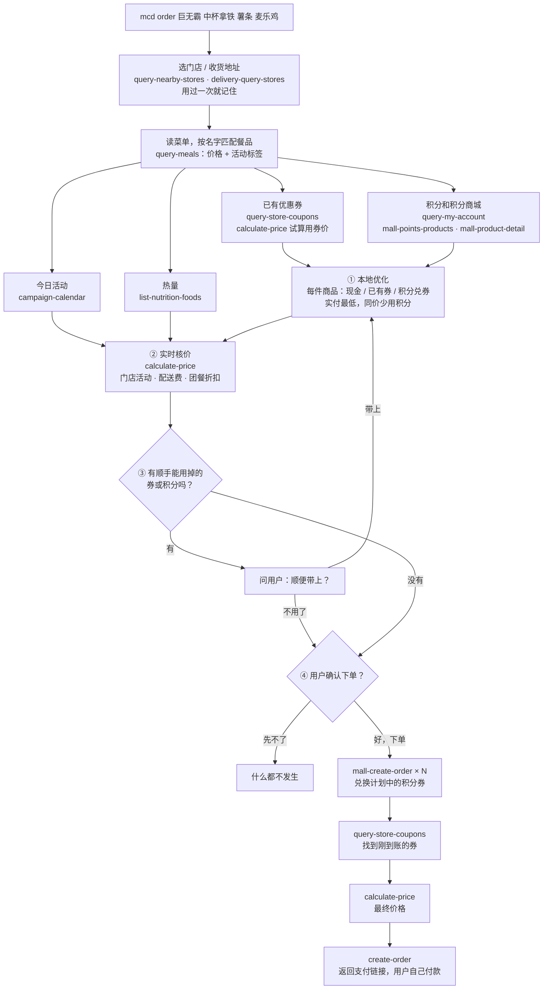
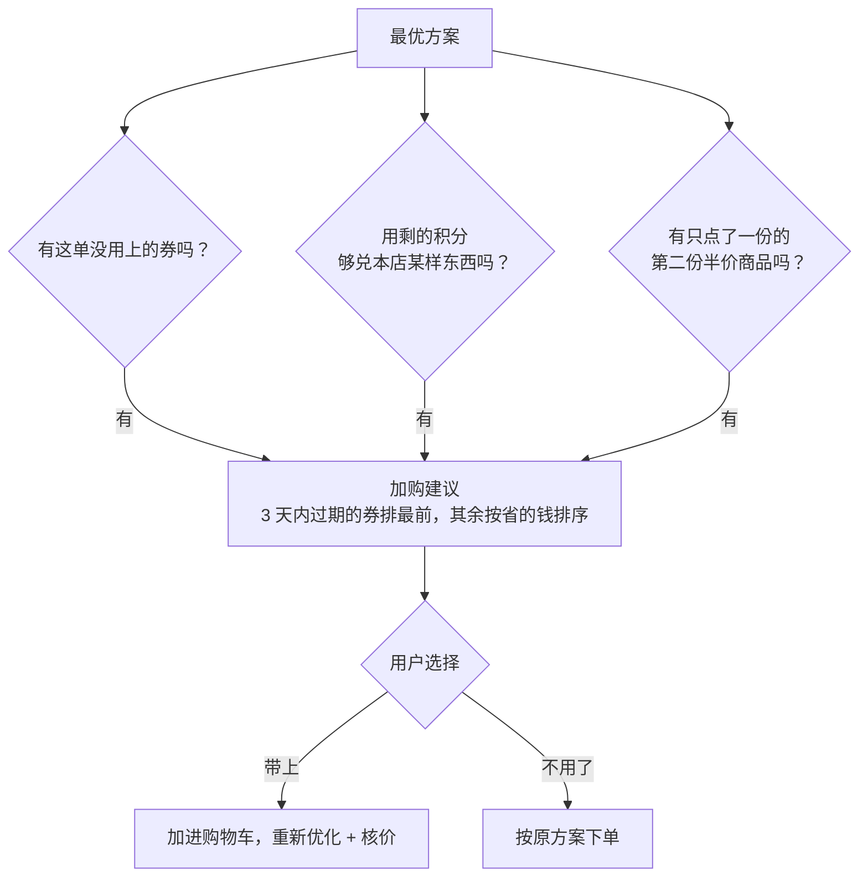
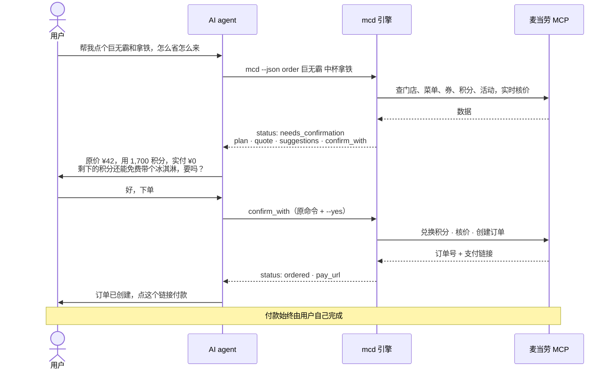
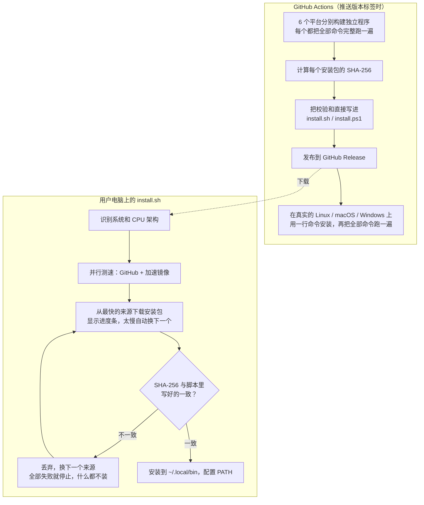
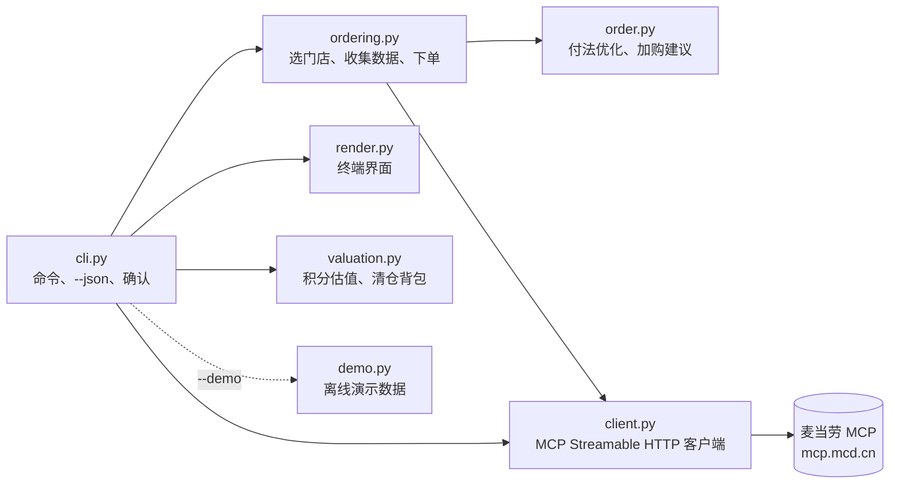

# 原理剖析

这篇文档讲清楚麦麦交易终端背后是怎么工作的：一句话点餐时调用了哪些麦当劳 MCP 工具、“最省的付法”是怎么算出来的、为什么不能靠直觉、AI 调用时如何保证安全，以及一行命令安装为什么可信。

- [整体流程](#整体流程)
- [核心问题：一单怎么付最省](#核心问题一单怎么付最省)
- [实时核价：本地估算 + 服务端为准](#实时核价本地估算--服务端为准)
- [加购建议：区分“想买的”和“顺便更划算的”](#加购建议区分想买的和顺便更划算的)
- [AI agent 调用流程](#ai-agent-调用流程)
- [一行命令安装的安全链路](#一行命令安装的安全链路)
- [代码结构](#代码结构)

## 整体流程

`mcd order 巨无霸 中杯拿铁 薯条 麦乐鸡` 从输入到拿到支付链接，经过四个阶段：

一次完整的点餐会用到 10 多个 MCP 工具。读取类的调用都在确认之前完成；会产生后果的操作（兑换积分、创建订单）全部放在用户确认之后。

## 核心问题：一单怎么付最省

### 为什么不能靠直觉

演示里的这单：巨无霸、中杯拿铁、中份薯条、麦乐鸡，原价 ¥68.50。手上有 1,880 积分，还有两张券：9.9 元薯条券、11.9 元麦乐鸡券。积分商城里，这四样都能用积分兑换。

| 付法 | 怎么付 | 实付 |
| --- | --- | --- |
| 原价 | 全部现金 | ¥68.50 |
| 只用券 | 薯条、麦乐鸡用券，其余现金 | ¥63.80 |
| **直觉做法**：先换“每积分最值钱”的 | 拿铁、薯条、麦乐鸡用积分（共 1,500 积分），巨无霸付现金；两张券都浪费了 | ¥25.00 |
| **最优解** | 巨无霸、拿铁用积分（共 1,700 积分），薯条、麦乐鸡用券 | **¥21.80** |

直觉做法每一步看起来都很合理：拿铁每积分值 3.4 分，薯条 3.0 分，麦乐鸡 2.4 分，都比巨无霸的 2.1 分划算。但它没考虑到：薯条和麦乐鸡本来就有券可用，把积分花在它们身上，等于让券白白浪费。最优解要**同时**考虑券和积分，局部最优并不等于整体最优。

### 数学模型

对购物车里的每一件商品 *i*（`薯条x2` 算两件），从三种付法里选一种：

- **现金**：付菜单价 *pᵢ*；
- **已有券 c**：付用券价 *qc*（由 `calculate-price` 试算得到），每张券只能用一次；
- **积分兑券 m**：先花 *wm* 积分兑一张积分商城的券，这件商品不再付钱。

约束：用掉的积分总数 ≤ 积分预算 *B*，每张已有券最多用一次。

目标：**实付最低**；实付相同时，**少用积分**（积分留着下次用）。

这是一个带“每张券只能用一次”约束的**多选背包问题**（Multiple-Choice Knapsack）。

### 算法

1. **已有券**：一单里能用上的券通常只有几张，直接枚举每张券“不用”或“分给哪件商品”。同一款商品的几件是等价的，只保留一种分法，搜索量很小。券超过 8 张时退化为按节省金额贪心分配。
2. **积分**：对没分到券的商品做动态规划。积分价通常是 50 或 100 的倍数，先除以最大公约数，DP 表很小；1,880 积分只需要几十格。
3. **取最优**：每种券分配方案都配上它的最优积分方案，比较 `(节省金额, −积分)`，取最大的那个。

**正确性**：测试里随机生成 300 组购物车（1 到 5 件商品、0 到 3 张券、0 到 4 个积分商品、不同的积分预算），每组都和暴力枚举所有组合的结果对比，全部一致。

### 积分清仓（`mcd spend`）

“把快过期的积分换成最值的东西”是另一个问题：在预算内选一批积分商品，让参考价值之和最大，每样最多换几份。这是**有界背包问题**，同样用缩放后的动态规划求解；价值相同时多用积分，因为这些积分本来就要过期了。它也和暴力枚举做过对比测试。

## 实时核价：本地估算 + 服务端为准

本地优化用的是菜单价和用券价，但有些事只有麦当劳服务端知道：

- 门店活动，比如“第二份半价”（菜单上只有一个标签，具体怎么减由服务端计算）；
- 外送的配送费；
- 团餐的满额折扣。

所以方案算出来之后，会把现金和已有券的部分交给 `calculate-price` 实时报价，确认框里显示的是**核价后的金额**。真正下单前还会再核一次。例如点两份麦辣鸡腿堡：本地估算 ¥47.00，核价后 ¥35.25，第二份半价被服务端正确算上了。

## 加购建议：区分“想买的”和“顺便更划算的”

算出最优方案后，还会检查有没有“不加白不加”的东西：

建议只是问你，**不会替你加**。演示里，最优方案用掉 1,700 积分后还剩 180，正好够免费换一个 150 积分的圆筒冰淇淋，而且这些积分下个月就过期。

## AI agent 调用流程

agent 通过 `--json` 调用引擎。会扣积分或下单的命令，不加 `--yes` 只返回方案，所以 agent **无法**在用户不知情的情况下下单：

## 一行命令安装的安全链路

`curl … | bash` 很方便，但用户需要信任下载下来的东西。整条链路是这样设计的：

要点：

- **校验和写在安装脚本里**：安装时不需要再单独下载校验文件。国内网络下，从 GitHub 下载这个文件常常卡住，这样整个安装都可以只走镜像。
- **镜像只提供安装包**：即使某个镜像返回了被篡改的文件，SHA-256 也对不上，会被丢弃。测试中模拟了“恶意镜像测速最快”的情况，安装器会丢弃它的文件，改用其他来源。
- **每个请求都有超时**：遇到连上了却不传数据的来源，最多等 20 秒左右就换下一个，不会一直卡住。
- **打包后的程序也要完整测一遍**：`packaging/e2e.py` 用演示数据把每个命令和子命令都跑一遍（帮助、终端界面、`--json`、确认和拒绝），共 80 多个场景，任何报错都会让发布失败。打包时会裁掉用不到的模块，这一步能保证没有裁掉还会用到的东西。
- **兼容 macOS 自带的 bash 3.2**：用 Apple 开源的 bash 3.2.57 源码编译后实际验证过。

## 代码结构

- `order.py`、`valuation.py`、`content.py` 是纯逻辑，不做任何网络请求，便于测试；
- `client.py` 直接实现 MCP 的 JSON-RPC over HTTP（协议版本 2025-06-18），不依赖特定版本的 SDK，并有与官方 MCP SDK 服务端的互通测试；
- `demo.py` 模拟用到的全部 25 个工具，所以演示模式走的是和真实模式完全相同的解析和计算代码；`tests/fixtures/real/` 里是脱敏后的真实返回，测试会用它们直接跑 `today`、`orders`、`track`、`market` 等命令，保证和线上格式一致。
